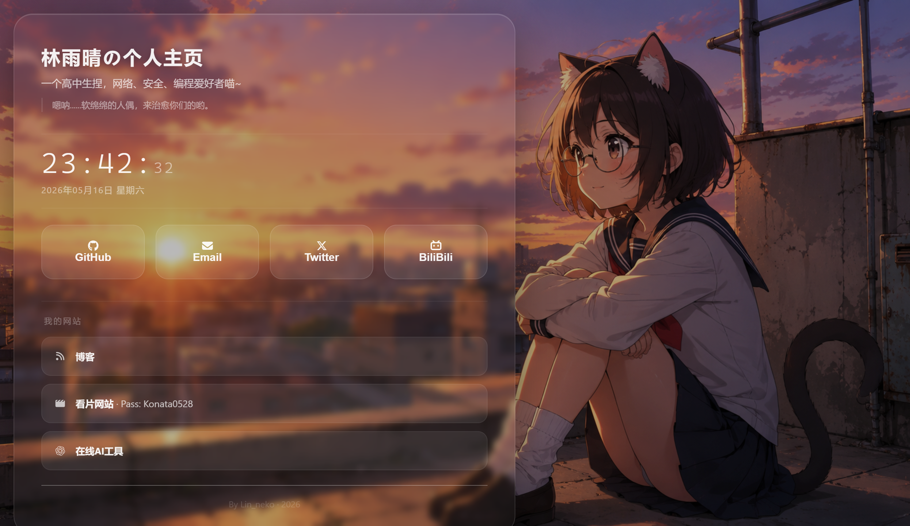

# GlassStyleHomepage

> 一个基于 **Glassmorphism** 设计风格的个人主页，简洁、优雅、开箱即用

<div style="text-align: center;">
    Preview
</div>


---

## ✨ 特性

| 特性 | 说明 |
|---|---|
| **玻璃拟态 UI** | 毛玻璃背景、半透明边框、细腻光影，适配深色背景 |
| **实时时钟** | 等宽字体展示时分秒，带中文日期，每秒刷新 |
| **一言 API** | 集成 [hitokoto.cn](https://hitokoto.cn)，每次刷新随机展示句子 |
| **联系方式弹窗** | 点击社交按钮弹出卡片，展示 GitHub / Email / Twitter / Bilibili 等账号 |
| **网址导航** | 可自定义链接，快速跳转个人站点 |
| **响应式布局** | 适配桌面、平板、手机，按钮在移动端自动切换为横向排列 |
| **CSS 设计令牌** | 所有颜色、圆角、阴影集中定义在 `:root` 变量中，一键换肤 |

无需任何构建工具或依赖，纯静态 HTML/CSS/JS，任何静态服务器或vercel均可直接部署
---

## ⚙️ 自定义配置指南

### 1. 社交账号 — `js/contacts.js`

修改 `CONTACTS` 对象中的 `value` 和 `action.url` 即可替换为你的信息：

```js
github: {
    value: '你的用户名',               // ← 改这里
    action: { url: 'https://github.com/你的用户名/' }
}
```

### 2. 设计风格 — `css/style.css`

在 `:root` 中调整 CSS 变量即可全局生效：

```css
:root {
    --glass-bg:       rgba(255, 255, 255, 0.03);  /* 玻璃透明度 */
    --border-default: rgba(255, 255, 255, 0.12);  /* 边框颜色 */
    --radius-container: 28px;                      /* 容器圆角 */
}
```

### 3. 背景图片 — `img/bg.png`

替换 `img/bg.png` 为你自己的背景图即可

### 4. 网站导航 — `index.html`

在 `.info-section` 内增删 `<a class="info-item">` 卡片：

```html
<a class="info-item" href="https://你的网站" target="_blank">
    <i class="fontawesome图标或你自己的图标"></i>
    <span><strong>名称</strong>介绍</span>
</a>
```

### 5. 标题 & 简介 — `index.html`

修改 `<h1>` 和 `.subtitle` 中的文本内容

---

## 📁 项目结构

```
GlassStyleHomepage/
├── index.html         # 主页面
├── css/
│   └── style.css      # 全局样式
├── js/
│   ├── contacts.js    # 社交联系方式数据
│   ├── clock.js       # 实时时钟逻辑
│   └── modal.js       # 弹窗交互逻辑
├── img/
│   └── bg.png         # 背景图片
└── readme.md
```